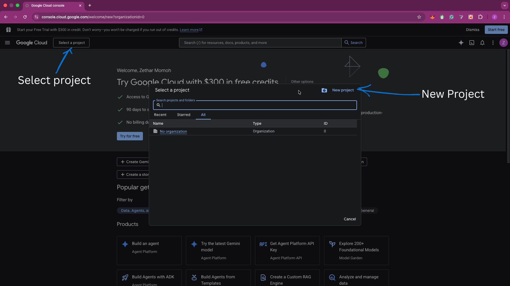
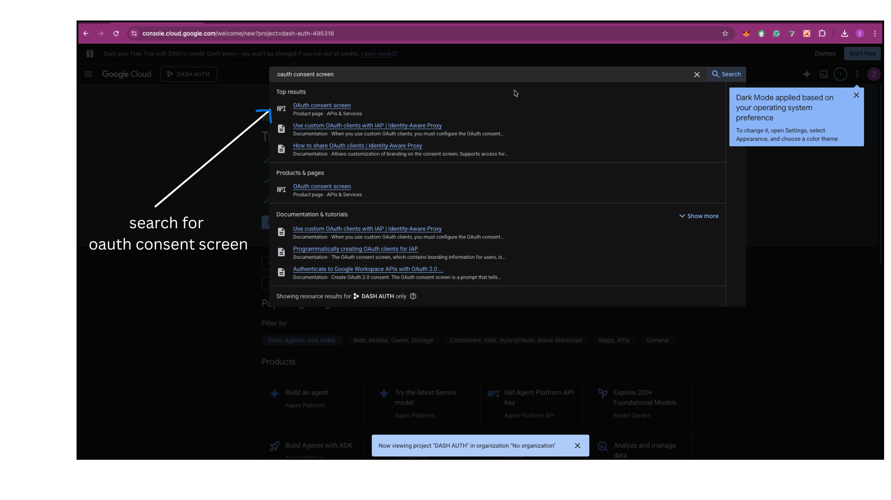
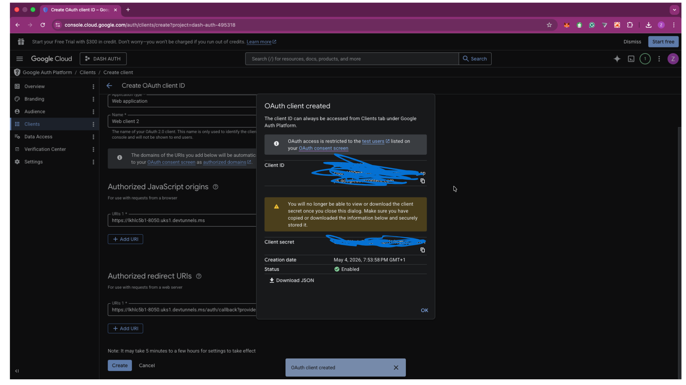

# Dash Social Signin

Social sign-in helpers for Dash. This package ships vanilla JS/CSS assets that render OAuth provider buttons and redirect the user to the provider authorization endpoint, plus server-side helpers to verify the OAuth callback.

> Note: OAuth requires a backend to exchange the authorization `code` for tokens. In Dash, the backend is your Dash server (Flask).

## Install

```bash
pip install dash-social-signin
```

## Quick start

1) Copy assets into your Dash app's `assets/` folder:

```python
from dash_social_signin import install_assets

# Point this to your Dash app's assets directory
install_assets("./assets")
```

2) Add a container with configuration:

```python
from dash import Dash, html
from dash_social_signin import build_container

app = Dash(__name__)

app.layout = html.Div(
    build_container(
        {
            "providers": {
                "google": {
                    "clientId": "YOUR_GOOGLE_CLIENT_ID",
                    "redirectUri": "https://your.app/auth/callback",
                    "scope": "openid email profile",
                    "state": "abc123"
                },
                "github": {
                    "clientId": "YOUR_GITHUB_CLIENT_ID",
                    "redirectUri": "https://your.app/auth/callback",
                    "scope": "read:user user:email"
                }
            }
        },
        id="social-signin"
    )
)

if __name__ == "__main__":
    app.run_server(debug=True)
```

The JS will render buttons into the container automatically.

## Example app

See [examples/app.py](examples/app.py) for a runnable demo.

The example includes placeholders for all supported providers.

Set provider credentials as environment variables before running the example:

```bash
export GOOGLE_CLIENT_ID="your-google-client-id"
export GOOGLE_CLIENT_SECRET="your-google-client-secret"
```

You can also use a `.env` file. Use `.env.example` as a guide.

To load `.env` automatically in the example app:

```bash
pip install python-dotenv
```

Use the same pattern for other providers, e.g. `GITHUB_CLIENT_ID` / `GITHUB_CLIENT_SECRET`.

If you use the PKCE start route, set `DASH_SOCIAL_SIGNIN_SECRET` to enable Flask sessions. See .env.example for the full list.

```bash
python examples/app.py
```

## Minimal backend callback example (Flask, Google)

This is the smallest possible server-side route that receives the authorization `code` and exchanges it for tokens with Google.
It includes optional PKCE support (recommended) and a simple userinfo fetch.

```python
import base64
import hashlib
import os
import secrets
import requests
from flask import request, redirect, session

def build_pkce_verifier() -> str:
    return secrets.token_urlsafe(64)

def build_pkce_challenge(verifier: str) -> str:
    digest = hashlib.sha256(verifier.encode("utf-8")).digest()
    return base64.urlsafe_b64encode(digest).rstrip(b"=").decode("utf-8")

@app.server.route("/auth/callback")
def auth_callback():
    code = request.args.get("code")
    if not code:
        return "Missing code", 400

    token_url = "https://oauth2.googleapis.com/token"
    data = {
        "grant_type": "authorization_code",
        "code": code,
        "redirect_uri": "https://your.app/auth/callback",
        "client_id": os.environ.get("GOOGLE_CLIENT_ID"),
        "client_secret": os.environ.get("GOOGLE_CLIENT_SECRET"),
    }

    # Optional PKCE: store the verifier in session before the auth redirect
    # and send it here. If you did not use PKCE, remove this field.
    code_verifier = session.get("pkce_verifier")
    if code_verifier:
        data["code_verifier"] = code_verifier

    resp = requests.post(token_url, data=data, timeout=10)
    resp.raise_for_status()
    tokens = resp.json()

    userinfo = requests.get(
        "https://openidconnect.googleapis.com/v1/userinfo",
        headers={"Authorization": f"Bearer {tokens.get('access_token')}"},
        timeout=10,
    ).json()

    # TODO: create a session / set cookies, then redirect into the app
    return redirect("/")
```

## Verification helpers (Dash server)

These helpers run on the same Dash server process to exchange the `code` for tokens and fetch a user profile when supported.

Store provider credentials in environment variables (or your secrets manager) and pass them into the helper.

```python
from flask import request
from dash_social_signin import verify_oauth_callback

@app.server.route("/auth/callback")
def auth_callback():
    provider = request.args.get("provider")
    code = request.args.get("code")
    if not provider or not code:
        return "Missing provider or code", 400

    tokens, userinfo = verify_oauth_callback(
        provider=provider,
        code=code,
        redirect_uri=f"https://your.app/auth/callback?provider={provider}",
        client_id="YOUR_CLIENT_ID",
        client_secret="YOUR_CLIENT_SECRET",
    )

    # TODO: create a session / set cookies, then redirect into the app
    return "Signed in"
```

## PKCE start route (Dash server)

Use a small server route to generate a PKCE verifier and redirect to the provider. Then point `authUrl` to this route.

```python
from flask import redirect, request, session
from dash_social_signin import build_authorize_url, build_pkce_challenge, build_pkce_verifier

@app.server.route("/auth/start")
def auth_start():
    provider = request.args.get("provider")
    if not provider:
        return "Missing provider", 400

    verifier = build_pkce_verifier()
    session[f"pkce_verifier:{provider}"] = verifier
    challenge = build_pkce_challenge(verifier)

    auth_url = build_authorize_url(
        provider=provider,
        client_id="YOUR_CLIENT_ID",
        redirect_uri=f"https://your.app/auth/callback?provider={provider}",
        scope=request.args.get("scope"),
        state=request.args.get("state"),
        response_type=request.args.get("response_type", "code"),
        code_challenge=challenge,
    )

    return redirect(auth_url)
```

## Supported providers

- Google
- Facebook
- GitHub
- X (Twitter)
- LinkedIn
- Microsoft
- Apple
- Discord
- Slack

Note: Some providers do not return userinfo. Apple returns `None` for userinfo.

## Connect and contribute

- PayPal: https://www.paypal.com/paypalme/omonbudeemma
- LinkedIn: https://www.linkedin.com/in/budescode


## Provider config

Each provider accepts:

- `clientId` (required)
- `redirectUri` (required)
- `scope` (optional, provider specific)
- `state` (optional)
- `responseType` (optional, default `code`)
- `extraParams` (optional dict of additional query params)
- `authUrl` (optional override)

## Backend exchange

After the redirect, your Dash server should handle the `code` query param and exchange it for tokens using the provider's OAuth token endpoint.

## License

MIT

## Provider credential setup (step-by-step)

Use these steps to create credentials for each provider. The redirect URL must match exactly.
For local dev, the pattern is:

- Redirect URI: http://localhost:8050/auth/callback?provider=PROVIDER
- JavaScript origin (if required by the provider): http://localhost:8050

If you are using a tunnel, replace `http://localhost:8050` with your tunnel origin and
update the `redirectUri` in [examples/app.py](examples/app.py) to match exactly.

### Google

Env vars:

```bash
export GOOGLE_CLIENT_ID="your-google-client-id"
export GOOGLE_CLIENT_SECRET="your-google-client-secret"
```

Alternatively, add these to `.env` (the example app loads `examples/.env` automatically).

Steps:

1) Open [Google Cloud Console](https://console.cloud.google.com/) and select (or create) a project.
2) Go to OAuth consent screen, set the app name and required fields, and save.
3) Go to Credentials -> Create credentials -> OAuth client ID,
   or open https://console.cloud.google.com/auth/clients/create
4) Choose Application type: Web application.
5) Add Authorized JavaScript origins:
    - http://localhost:8050
6) Add Authorized redirect URIs:
    - http://localhost:8050/auth/callback?provider=google
7) Save and copy the Client ID and Client Secret.

Screenshots (optional):

- OAuth consent screen setup



- Create OAuth client ID (Web application)



- Authorized redirect URIs section



### Facebook

Env vars:

```bash
export FACEBOOK_CLIENT_ID="your-facebook-app-id"
export FACEBOOK_CLIENT_SECRET="your-facebook-app-secret"
```

Steps:

1) Open Meta for Developers and create an app.
2) Add the Facebook Login product.
3) In Facebook Login settings, add Valid OAuth Redirect URIs:
    - http://localhost:8050/auth/callback?provider=facebook
4) In App settings -> Basic, copy App ID and App Secret.

### GitHub

Env vars:

```bash
export GITHUB_CLIENT_ID="your-github-client-id"
export GITHUB_CLIENT_SECRET="your-github-client-secret"
```

Steps:

1) Go to GitHub Settings -> Developer settings -> OAuth Apps.
2) Click New OAuth App.
3) Set Authorization callback URL:
    - http://localhost:8050/auth/callback?provider=github
4) Save and copy Client ID and Client Secret.

### X (Twitter)

Env vars:

```bash
export X_CLIENT_ID="your-x-client-id"
export X_CLIENT_SECRET="your-x-client-secret"
```

Steps:

1) Open the X Developer Portal and create a project/app.
2) Enable OAuth 2.0 (PKCE recommended).
3) Add Callback URL:
    - http://localhost:8050/auth/callback?provider=x
4) Save and copy Client ID and Client Secret.

### LinkedIn

Env vars:

```bash
export LINKEDIN_CLIENT_ID="your-linkedin-client-id"
export LINKEDIN_CLIENT_SECRET="your-linkedin-client-secret"
```

Steps:

1) Go to LinkedIn Developers and create an app.
2) In Auth settings, add Authorized redirect URLs:
    - http://localhost:8050/auth/callback?provider=linkedin
3) Copy Client ID and Client Secret.

### Microsoft

Env vars:

```bash
export MICROSOFT_CLIENT_ID="your-microsoft-client-id"
export MICROSOFT_CLIENT_SECRET="your-microsoft-client-secret"
```

Steps:

1) Go to Azure Portal -> App registrations -> New registration.
2) Add a Web platform and set Redirect URI:
    - http://localhost:8050/auth/callback?provider=microsoft
3) Save and copy Application (client) ID.
4) Create a client secret under Certificates & secrets.

### Apple

Env vars:

```bash
export APPLE_CLIENT_ID="your-apple-service-id"
export APPLE_CLIENT_SECRET="your-apple-client-secret"
```

Steps:

1) Go to Apple Developer -> Certificates, Identifiers & Profiles.
2) Create a Services ID and enable Sign In with Apple.
3) Add Return URL:
    - http://localhost:8050/auth/callback?provider=apple
4) Generate a client secret (JWT) for the Services ID.

### Discord

Env vars:

```bash
export DISCORD_CLIENT_ID="your-discord-client-id"
export DISCORD_CLIENT_SECRET="your-discord-client-secret"
```

Steps:

1) Go to Discord Developer Portal and create an application.
2) In OAuth2 settings, add Redirects:
    - http://localhost:8050/auth/callback?provider=discord
3) Copy Client ID and Client Secret.

### Slack

Env vars:

```bash
export SLACK_CLIENT_ID="your-slack-client-id"
export SLACK_CLIENT_SECRET="your-slack-client-secret"
```

Steps:

1) Go to Slack API and create an app.
2) In OAuth & Permissions, add Redirect URLs:
    - http://localhost:8050/auth/callback?provider=slack
3) Copy Client ID and Client Secret.
